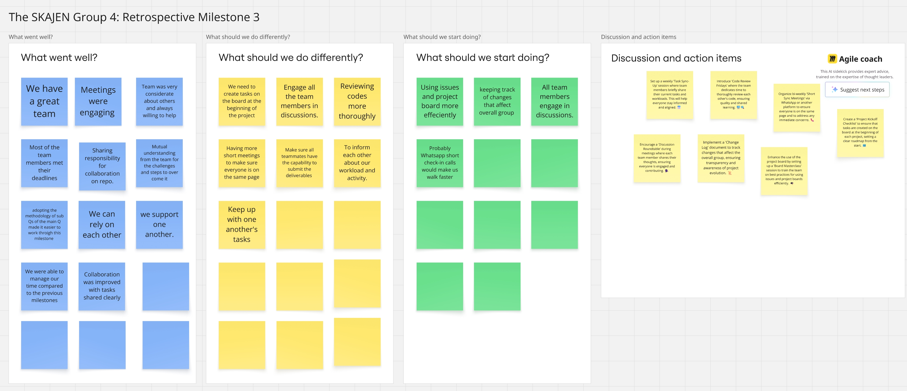

# 📌 Milestone 3 Retrospective – Group 4 (SKAJEN)

---

## 👥 Participants

- **Khadija al Ramlawi**
- **Nelson Fodjo Kamdoum**
- **Olubusayo Solola (Simi)**
- **Shayma Mohamed**
- **Yevheniia Rudenko**
- **Yuri Spizhovyi**

---

## ✅ What Went Well

- **We have a great team**: Everyone was supportive, helpful, and considerate.
- **Meetings were engaging** and productive, with mutual understanding and strong communication.
- **Most members met their deadlines**, which improved overall momentum.
- **Collaboration improved** through clearly shared tasks and responsibilities.
- The **sub-question methodology** helped break down the research problem and allowed parallel progress.
- We were able to **manage our time better** than in previous milestones.
- **Team members supported each other**, and we could rely on one another.

---

## 🔁 What Should We Do Differently

- **Create tasks on the project board earlier** in the milestone to ensure clear planning and ownership.
- **Engage all team members** more consistently in discussions and decision-making.
- **Review code more thoroughly** to maintain quality and shared understanding.
- **Hold more frequent short check-ins** to ensure everyone stays aligned.
- Make sure everyone is **technically able to submit deliverables**.
- Improve transparency by **informing each other about workload and progress**.
- **Keep up with one another’s tasks** to prevent blockers.

---

## 🚀 What Should We Start Doing

- **Use GitHub Issues and the Project Board more effectively** to track and delegate work.
- **Track changes that affect the entire group**, especially when they impact shared files or direction.
- Ensure **all members actively participate in discussions** to maintain shared ownership.
- Consider **brief WhatsApp check-in calls** to speed up coordination.
- Introduce a **weekly “Task Sync-Up” session** to keep everyone informed.
- Assign regular **code review slots**, such as “Code Review Fridays,” to support shared learning.
- Start a **Change Log** to track significant updates transparently.
- Create a **Project Kickoff Checklist** to ensure smoother starts to new milestones.

---

## 🧠 Lessons Learned

- Strong team collaboration and mutual respect are foundational to project success.
- Dividing the main question into sub-questions allowed us to work in parallel and stay productive.
- Skipping early planning and inconsistent documentation created some inefficiencies.
- Proactive participation from all members is essential to avoid misunderstandings and uneven progress.
- Structured workflows (PR reviews, regular updates) helped us improve from previous milestones.

---

## 🔍 Strategy Review

**What went according to plan?**

- Collaborative work using GitHub and Slack was consistent.
- Most members met deadlines, and meetings were focused and helpful.
- Task sharing and the use of sub-questions created clear scope and ownership.

**What didn’t go as planned?**

- Some team members were occasionally less involved in discussions.
- Code reviews were not always done thoroughly.
- Tasks were sometimes started without being formally added to the board.
- Meeting notes were not always recorded, causing occasional confusion.

**What adjustments did we make?**

- We added informal syncs (via WhatsApp and Slack).
- Additional encouragement was given to team members to be involved in decision-making.

**What unnecessary steps did we remove or streamline?**

- We began simplifying meeting structure and reduced time spent discussing items already agreed upon asynchronously.

---

## ✅ Action Items for Milestone 4

- Kick off with a **clear board setup** and assigned issues.
- Schedule a recurring **weekly sync** or task review session.
- Introduce **regular review and update cycles** for shared documentation and code.
- Encourage a **“roundtable moment” during meetings** to make sure everyone contributes.

---

## 📸 Miro Board Summary

The following image captures our full group retrospective discussion for Milestone 3:

---
